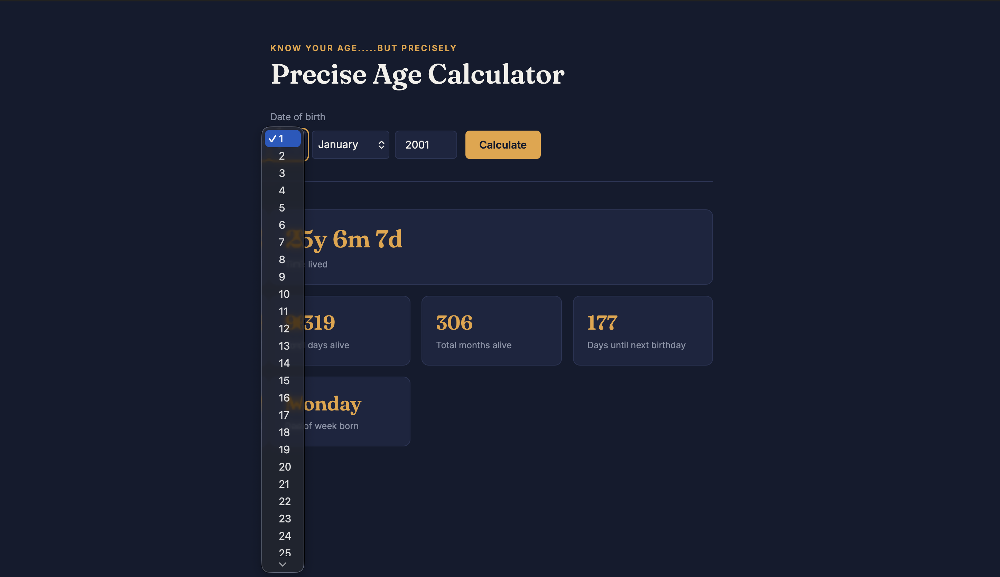
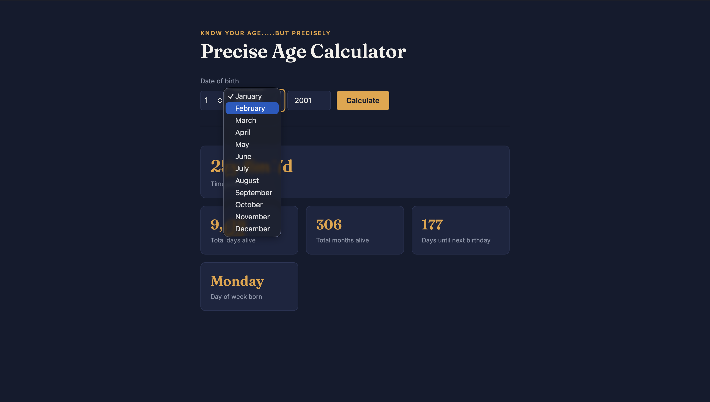
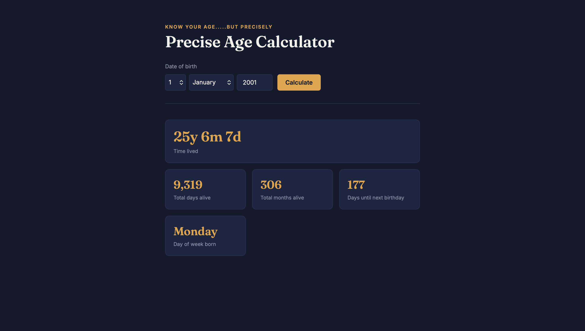
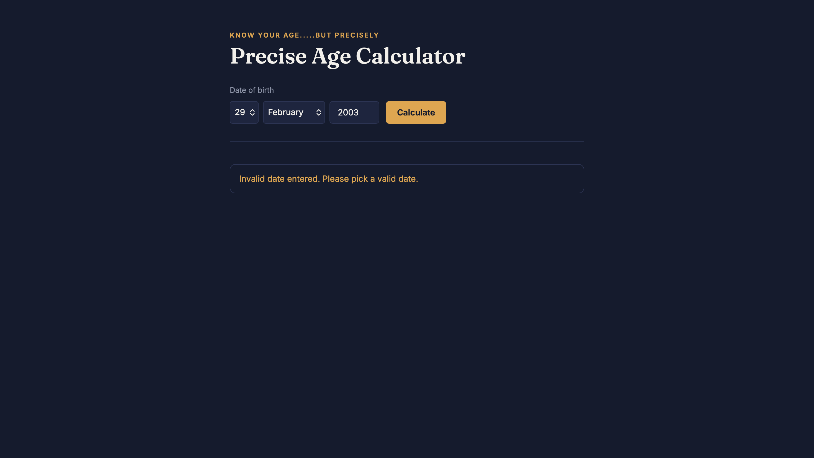

# Precise Age Calculator

A JavaScript age calculator that goes beyond "just years" — get your exact age down to the day, total days/months alive, days until your next birthday, and even what day of the week you were born on.

Built as a hands-on project to learn the native JavaScript `Date` API in depth.

## Preview

| Enter a date | Enter a month | Age calculated | Handles invalid input |
|---|---|---|---|
|  |  |  |  |

## Features

- Exact age breakdown: years, months, and days lived
- Total days alive
- Total months alive
- Days remaining until next birthday
- Day of the week you were born on
- Supports any historical date (not limited to recent years — calculate the age of a birth date from centuries ago)
- Handles edge cases: invalid dates, future dates, and same-day birthdays

## Tech Stack

- HTML
- CSS
- Vanilla JavaScript (no frameworks or libraries)

## Running Locally

1. Clone the repo:
```bash
   git clone https://github.com/Vrishali34/precise-age-calculator-js.git
```
2. Open `index.html` in your browser (or use a tool like VS Code's Live Server extension).

No build steps or dependencies required.

## What I Learned

This project was built specifically to understand JavaScript's `Date` object beyond the basics:

- How `Date` objects internally store timestamps in milliseconds, and how subtracting two dates gives a raw millisecond difference
- The "day 0 rolls back to the previous month" trick (`new Date(year, month, 0)`) for correctly calculating days in a month, including leap years
- How to detect invalid dates using `isNaN(date.getTime())`
- Comparing dates while ignoring time-of-day, to correctly handle "birthday is today" as an edge case
- Populating `<select>` dropdowns dynamically with JavaScript instead of hardcoding HTML options

## Possible Improvements

- Handle the Feb 29 leap-day edge case for "days until next birthday" (currently rolls to March 1 in non-leap years)
- Add a dark/light theme toggle
- Show a fun fact based on the birth year (e.g., major historical events)

## License

MIT
